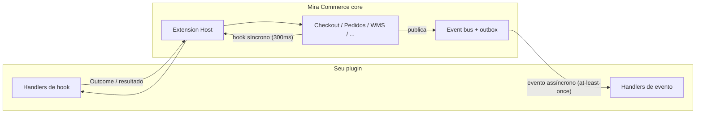

# commerce-ext — SDK de plugins do Mira Commerce

`commerce-ext` é o **Extension Protocol** do [Mira Commerce](https://mira-dev.tech): o contrato
público que permite estender o core da plataforma com **plugins Go** — sem fork,
sem tocar no código do core.

```go
import commerceext "github.com/mira-dev-tech/commerce-ext"
```

Este módulo é a **única** dependência que um plugin pode ter da plataforma.
Plugins nunca importam código interno do core — é isso que garante que um
upgrade de core não quebra o seu plugin (e vice-versa).

> **Quer começar por código?** Clone o template
> [`mira-commerce-plugin-example`](https://github.com/mira-dev-tech/mira-commerce-plugin-example) —
> um plugin completo, comentado linha a linha, com testes e CI.

---

## Como funciona — a visão de 1 minuto

O core expõe um **Extension Host**. Plugins se registram nele e passam a
participar dos fluxos de negócio por dois mecanismos:



| Mecanismo | Quando usar | Característica |
|-----------|-------------|----------------|
| **Hook** | Precisa **decidir ou alterar** algo no meio do fluxo (bloquear um pedido, ajustar um preço) | Síncrono, timeout de 300ms, panic-safe |
| **Evento** | Precisa **reagir** a algo que já aconteceu (pedido confirmado → creditar pontos) | Assíncrono, entrega at-least-once, nunca bloqueia o fluxo de origem |

## O contrato

Todo plugin implementa 4 métodos:

```go
type Plugin interface {
    Meta() Meta                                  // identidade + compatibleCore (semver)
    Init(ctx context.Context, rt *Runtime) error // recebe config, secrets, logger, eventos
    Register(reg *Registry) error                // declara hooks e eventos
    Shutdown(ctx context.Context) error          // libera recursos
}
```

Ciclo de vida: o host chama `Init` **uma vez** (é o único momento de ler
config), depois `Register`, e daí em diante só invoca os handlers registrados.
`Shutdown` roda no desligamento do processo.

O `Runtime` injetado em `Init` traz:

| Campo | O que é |
|-------|---------|
| `Config map[string]any` | Configuração do plugin (vinda do manifest/host) |
| `Secrets map[string]string` | Credenciais — **nunca** logar valores |
| `Logger` | Logger estruturado (`Info/Warn/Error`, pares chave-valor) |
| `Events` | Assinatura de eventos do core |

## Hooks — catálogo (v0.2)

Registre com `reg.On<Hook>(prioridade, fn)`. **Prioridade menor executa
primeiro**; convenção: 100–300 plugins de cliente, 400 genéricos, 500+ plugins
de referência, 1000 baseline do core.

| Hook | Roda quando | Assinatura do handler |
|------|-------------|----------------------|
| `checkout.validate` | Antes de aceitar um checkout | `CheckoutValidateInput → Outcome` |
| `checkout.quote_adjust` | Antes de persistir o pedido (totais) | `QuoteAdjustInput → QuoteAdjustResult` |
| `checkout.risk_assess` | Na tentativa de pagamento | `RiskAssessInput → Outcome` |
| `order.pre_confirm` | No submit do pedido | `OrderView → Outcome` |
| `order.pre_cancel` | No cancelamento | `OrderView → Outcome` |
| `payment.route` | Ao escolher gateway/3DS | `PaymentRouteInput → PaymentRouteDecision` |
| `payment.installment_resolve` | Ao resolver parcelamento | no catálogo (`hooks.go`); registro público via `Registry` ainda não exposto |
| `catalog.price_resolve` | Ao resolver preço de SKU | `PriceResolveInput → PriceResolveResult` |
| `inventory.allocate` | Ao alocar estoque por linha | `InventoryAllocateInput → Outcome` |
| `member.eligibility` | Antes de ação de member | `MemberEligibilityInput → Outcome` |
| `shipping.quote` | Ao cotar frete | `ShippingQuoteInput → ShippingQuoteResult` |
| `tax.resolve` | Ao calcular impostos | `TaxResolveInput → TaxResolveResult` |
| `integration.transform_outbound` / `_inbound` | Payload de/para ERP | `IntegrationTransformInput → IntegrationTransformResult` |
| `wms.ean.lookup` | Cache miss de EAN | `WmsEanLookupInput → WmsEanLookupResult` |
| `wms.inbound_nfe.resolve` | Draft de NF-e de entrada | `WmsInboundNfeResolveInput → WmsInboundNfeResolveResult` |
| `wms.product_draft.enrich` | Enriquecimento de draft de produto | `WmsProductDraftEnrichInput → WmsProductDraftEnrichResult` |
| `wms.movement.validate` | Antes de movimento de estoque | `WmsMovementValidateInput → Outcome` |

A lista canônica com todos os tipos está em [`hooks.go`](hooks.go) e
[`types.go`](types.go).

### Semânticas que você precisa saber

- **`Outcome`**: `Allowed()` deixa o fluxo seguir; `Denied(code, msg)` bloqueia.
  O `code` é **contrato** — front e suporte dependem dele; não renomeie depois
  de publicado.
- **Falha degrada com segurança**: se o handler estourar o timeout de 300ms ou
  der panic, o host responde `plugin_failure` (fail-closed nos hooks de
  bloqueio). Por isso: **nada de I/O bloqueante dentro de hook** — trabalho
  pesado vai para um handler de evento.
- **Cadeia de `checkout.quote_adjust`** (vários plugins no mesmo hook):
  `Discount` **acumula**; `TotalAmount > 0` **sobrescreve** o total corrente
  (`0` preserva); qualquer deny **para a cadeia** e bloqueia o checkout.

## Eventos — catálogo (v0.2)

Registre com `reg.OnEvent(tipo, handler)`. O envelope é CloudEvents-like:

```go
type Event struct {
    ID, Type, Source, TenantID string
    Time time.Time
    Data map[string]any // ex.: {"order_id": "...", "total_amount": 123.45}
}
```

`order.created` · `order.confirmed` · `order.cancelled` · `payment.authorized` ·
`payment.captured` · `payment.attempt.failed` · `payment.attempt.blocked` ·
`inventory.reserved` · `inventory.released` · `inventory.movement.recorded` ·
`wms.product_draft.ready` · `wms.inbound_nfe.draft_ready` ·
`wms.fulfillment.picking_started` · `wms.fulfillment.dispatched`

**Regra de ouro — idempotência pela chave de negócio.** A entrega é
at-least-once e o mesmo fato pode chegar em mais de um evento (IDs distintos).
Deduplique pelo identificador de negócio (`order_id`, etc.), não pelo
`Event.ID`. Erro retornado por handler de evento é logado, nunca propaga.

## Manifest — declare o que o plugin usa

Todo plugin acompanha um `manifest.yaml`; o host valida hooks/eventos contra o
catálogo e a compatibilidade semver com a linha do protocolo:

```yaml
apiVersion: commerce.mira.dev/v1
kind: Plugin
id: meu-plugin
version: 1.0.0
compatibleCore: "^0.2.0"        # validado contra CoreLine (version.go)
runtime:
  type: in-process               # ou go-plugin (binário externo)
  binary: extensions/meu-plugin  # go-plugin: caminho do binário
capabilities:
  hooks: [checkout.quote_adjust, order.pre_confirm]
  events:
    subscribe: [order.confirmed]
```

Hook ou evento usado mas não declarado ⇒ falha na verificação
(`VerifyPluginManifest`).

## Dois modos de execução

1. **In-process** — o plugin é compilado junto do core (modo padrão para
   plugins mantidos pelo time da plataforma).
2. **go-plugin (externo)** — o plugin é um **binário separado**; o host sobe o
   processo e conversa por RPC. É o modo para código de terceiros/clientes.
   Seu `main` é uma linha:

   ```go
   func main() { commerceext.Serve(&meuPlugin{}) }
   ```

   O protocolo (implementado por [`serve.go`](serve.go)):
   - `./plugin --commerce-ext-handshake` → imprime `commerce-ext-ok` (probe)
   - `./plugin --commerce-ext-rpc 127.0.0.1:PORTA` → serve net/rpc até ser morto

## Versionamento

- A linha do protocolo é `CoreLine` ([`version.go`](version.go)); as tags deste
  repo acompanham (`v0.2.0` ↔ core API v0.2).
- `compatibleCore` do seu manifest usa semver (`^0.2.0` aceita toda a linha 0.2).

```bash
go get github.com/mira-dev-tech/commerce-ext@v0.2.0
```

## Teste de integração local — `plugintest`

O subpacote [`plugintest`](plugintest/) é um **mini Extension Host em memória**
para você testar integração sem acesso ao core. Ele reproduz as semânticas que
importam: cadeia por prioridade entre plugins, timeout de 300ms + panic-safe
(→ `PLUGIN_FAILURE`), acumulação/override do `checkout.quote_adjust`, pipeline
de `integration.transform_*`, e `PublishAtLeastOnce` — que entrega o mesmo
fato duas vezes com IDs distintos para provar que seu handler é idempotente
pela chave de negócio.

```go
import "github.com/mira-dev-tech/commerce-ext/plugintest"

host := plugintest.NewHost()
_ = host.Install(ctx, meuplugin.New(), plugintest.WithConfig(map[string]any{"min_subtotal": 300}))

out := host.QuoteAdjust(ctx, commerceext.QuoteAdjustInput{Subtotal: 500})
// out.Discount == 25, out.TotalAmount == 475

errs := host.PublishAtLeastOnce(ctx, commerceext.Event{
    Type: commerceext.EventOrderConfirmed,
    Data: map[string]any{"order_id": "o1", "total_amount": 500.0},
})
```

## Do plugin à produção — em resumo

O que você testa **sozinho, na sua máquina**: unidade dos handlers, integração
com o mini-host `plugintest`, o handshake do binário go-plugin e a paridade
`Register` ↔ manifest. O que roda **em ambiente Mirá**: o host real com dados
reais (workflow, outbox durável) e o aceite num checkout de verdade.

Caminhos para produção:

- **Dev interno (in-process)**: plugin entra no monorepo do core via PR, atrás
  de flag, e sobe no deploy normal da API.
- **Parceiro (go-plugin externo)**: entrega **código-fonte versionado** (nunca
  binário opaco — a Mirá audita e builda), validação em dev/staging, e em
  produção o manifest entra pinado por versão. Kill switch: remover o manifest
  do deploy + restart devolve o comportamento baseline.

O passo a passo completo, com a tabela de "o que roda onde", está no README do
template [`mira-commerce-plugin-example`](https://github.com/mira-dev-tech/mira-commerce-plugin-example#testando-o-seu-plugin--o-que-roda-onde).

## Governança deste repositório

- A **fonte de verdade** do protocolo vive no monorepo interno do core
  (`mira-commerce-core/commerce-ext`); este repositório é o espelho publicado
  para consumo externo — mudanças chegam aqui via sincronização, por isso a
  escrita é restrita à equipe Mirá.
- Forks são bem-vindos para estudar e criar seus plugins; use issues para
  dúvidas e sugestões sobre o protocolo.

## Anti-patterns (não faça)

| ❌ | ✅ |
|----|-----|
| Importar código interno do core | Só `commerce-ext` |
| I/O bloqueante dentro de hook | Hook decide rápido; trabalho pesado via evento |
| Handler de evento não-idempotente | Dedupe pela chave de negócio, persistido |
| Renomear código de bloqueio publicado | Código estável — é contrato |
| Logar valores de `Secrets` | Nunca |

## Ecossistema Mirá Commerce

📚 **Documentação pública: [docs.mira-dev.tech](https://docs.mira-dev.tech)**

| Repo | O que é |
|---|---|
| [mira-commerce-sdk-js](https://github.com/mira-dev-tech/mira-commerce-sdk-js) | SDKs oficiais JS/TS — `client-sdk` (API tipada) e `checkout-sdk` (checkout headless) |
| [mira-commerce-storefront-guide](https://github.com/mira-dev-tech/mira-commerce-storefront-guide) | Guia oficial para construir um storefront (vitrine + checkout) sobre as APIs |
| [commerce-ext](https://github.com/mira-dev-tech/commerce-ext) | SDK público de plugins — Extension Protocol |
| [mira-commerce-plugin-example](https://github.com/mira-dev-tech/mira-commerce-plugin-example) | Template de plugin — exemplo didático (hooks, eventos, manifest, go-plugin) |
| [mira-commerce-plugin-payment](https://github.com/mira-dev-tech/mira-commerce-plugin-payment) | Template de plugin de pagamento e antifraude (roteamento, 3DS, velocity) |
| [mira-commerce-plugin-shipping](https://github.com/mira-dev-tech/mira-commerce-plugin-shipping) | Template de plugin de logística/frete (cotação externa, cache, circuit breaker) |
